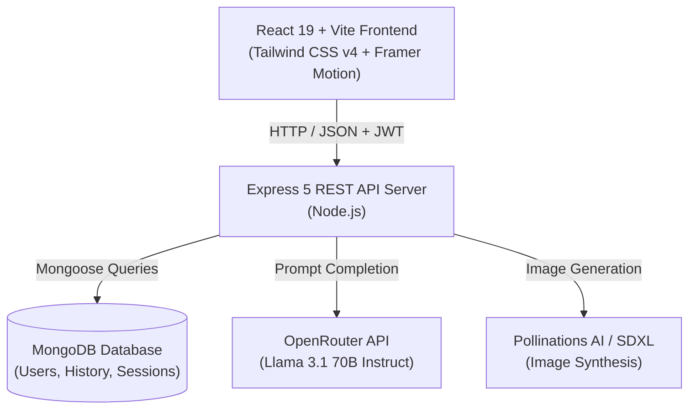

# 🚀 AI SaaS — Next-Generation All-In-One AI Platform

<div align="center">


<br/>

[](https://react.dev/)
[](https://vitejs.dev/)
[](https://tailwindcss.com/)
[](https://nodejs.org/)
[](https://www.mongodb.com/)
[](https://openrouter.ai/)
[](https://opensource.org/licenses/ISC)

<p align="center">
  A production-ready full-stack AI Software-as-a-Service (SaaS) web application offering text generation, smart summarization, image synthesis, multi-language translation, history management with dynamic pagination, user leveling, and real-time administrative analytics.
</p>

[Explore Features](#-features) • [Project Structure](#-project-structure) • [Tech Stack](#-tech-stack) • [Quick Start](#-getting-started) • [API Documentation](#-api-endpoints) • [License](#-license)

</div>

---

## 📖 Table of Contents

- [Overview](#-overview)
- [Key Features](#-features)
- [System Architecture](#-system-architecture)
- [Project Structure](#-project-structure)
- [Tech Stack](#-tech-stack)
- [Getting Started](#-getting-started)
  - [Prerequisites](#prerequisites)
  - [Backend Setup](#1-backend-setup)
  - [Frontend Setup](#2-frontend-setup)
- [Environment Variables](#-environment-variables)
- [API Endpoints](#-api-endpoints)
- [Database Models](#-database-models)
- [Roadmap](#-roadmap)
- [Author & License](#-author--license)

---

## 🌟 Overview

**AI SaaS** is a comprehensive multi-tool artificial intelligence platform designed for creators, developers, and professionals. It brings together high-performance open-source and commercial language models and image generation pipelines under a single sleek, dark-mode, animated interface.

With built-in **JWT authentication**, **gamified user tiers (Bronze, Silver, Gold, Platinum)**, **credit budgeting**, **per-user history tracking**, and an **interactive admin dashboard**, it provides a complete foundation for monetized AI apps.

---

## ✨ Features

### 🧠 AI Capabilities
- ✍️ **AI Text Generator**: High-speed completion and prompt engineering using `meta-llama/llama-3.1-70b-instruct` through OpenRouter. Includes quick copy, token counters, and usage tracking.
- 🎨 **AI Image Generator**: Multi-tier image generation pipeline leveraging **Pollinations AI** and **Stable Diffusion XL (SDXL)** fallback with instant base64 rendering, custom resolutions (`512x512`, `1024x1024`), and one-click image downloads.
- 📄 **Smart Summarizer**: Distills long articles, essays, and notes into key takeaways and concise bullet points.
- 🌐 **Multi-Language Translator**: Context-aware neural translation preserving formatting, tone, and nuances across global languages.

### 💼 Platform & SaaS Architecture
- 🔐 **Authentication & Security**: JWT-based session security, salted password hashing with `bcryptjs`, and protected API routes.
- 🏆 **Gamified Tier System**: Automatic level upgrades based on lifetime platform usage:
  - 🥉 **Bronze** (0–49 requests)
  - 🥈 **Silver** (50–199 requests)
  - 🥇 **Gold** (200–499 requests)
  - 💎 **Platinum** (500+ requests)
- 📜 **Unified History & Smart Pagination**:
  - Filterable by type: `All`, `Text`, `Summary`, `Images`, `Translate`
  - Real-time instant search across historical prompts and outputs
  - Smart conditional pagination: controls appear only when items exceed the selected page size (default: 25 items per page)
  - First / Previous / Page Numbers / Next / Last navigation controls
- 📊 **Admin Analytics Dashboard**:
  - Total users and request metrics
  - 7-day visual request trends chart using **Recharts**
  - Tool usage breakdown (Images vs Translations vs Text)
  - Recent user registration log
- 💳 **Billing & Pricing Plans**: Interactive pricing matrix featuring `Free`, `Pro`, and `Enterprise` subscription tiers.
- 🎨 **Ultra-Modern UI/UX**:
  - Dark-mode glassmorphic aesthetics
  - Micro-interactions & animations powered by **Framer Motion**
  - Collapsible sidebar with tooltips, active route indicators, and responsive mobile drawers
  - Toast notifications via **React Toastify**

---

## 🏗 System Architecture



---

## 📁 Project Structure

```text
Ai-Saas/
├── .gitignore                   # Root gitignore (protects secrets & node_modules)
├── README.md                    # Project documentation & GitHub showcase
├── TODO.md                      # Development task tracking
├── ai-saas/                     # Frontend Application (React + Vite)
│   ├── index.html               # Single-page application entry HTML
│   ├── package.json             # Frontend dependencies & scripts
│   ├── vite.config.js           # Vite build & bundler configuration
│   ├── public/                  # Public static assets
│   └── src/
│       ├── main.jsx             # React DOM root entry
│       ├── App.jsx              # Client-side router configuration
│       ├── App.css              # Global custom styles
│       ├── index.css            # Tailwind CSS v4 styling rules
│       ├── assets/              # Static media & illustrations
│       ├── context/
│       │   └── UsageContext.jsx # Global user usage & credit context
│       ├── layouts/
│       │   └── DashboardLayout.jsx # Collapsible navigation sidebar layout
│       └── pages/
│           ├── Landing.jsx      # High-converting landing page
│           ├── Login.jsx        # User login form
│           ├── Register.jsx     # User registration form
│           ├── DashboardHome.jsx# User metrics & fast-action shortcuts
│           ├── TextGenerator.jsx# AI content generation interface
│           ├── ImageGenerator.jsx# Text-to-image synthesis studio
│           ├── Summarizer.jsx   # Article & document summarizer
│           ├── Translator.jsx   # Neural multi-language translator
│           ├── History.jsx      # Activity log with search & pagination
│           ├── Billing.jsx      # Pricing plans & subscription cards
│           └── AdminDashboard.jsx# Analytics dashboard with Recharts
│
└── server/                      # Backend API (Express + Node.js)
    ├── package.json             # Server dependencies & scripts
    ├── server.js                # Express app initialization & route mounting
    ├── .env.example             # Template for required environment variables
    ├── .gitignore               # Server gitignore (protects .env & debug logs)
    ├── config/
    │   └── db.js                # MongoDB connection handler
    ├── controllers/
    │   ├── adminController.js   # Admin analytics & metrics
    │   ├── aiTextController.js  # Llama 3.1 text generation logic
    │   ├── authController.js    # Register, login & user stats logic
    │   ├── chatController.js    # Conversational chat handler
    │   ├── imageController.js   # Multi-tier image generation handler
    │   ├── paraphraseController.js # Text rephrasing logic
    │   ├── summarizerController.js # Text summarization logic
    │   └── translatorController.js # Multi-language translation logic
    ├── middlewares/
    │   └── authMiddleware.js    # JWT authorization & route protection
    ├── models/
    │   ├── User.js              # User schema (roles, credits, levels)
    │   ├── History.js           # Activity logs schema
    │   └── ChatSession.js       # Chat sessions schema
    └── routes/
        ├── adminRoutes.js       # Admin endpoints
        ├── aiTextRoutes.js      # Text generation endpoints
        ├── authRoutes.js        # Authentication endpoints
        ├── chatRoutes.js        # Chat endpoints
        ├── historyRoutes.js     # User history endpoints
        ├── imageRoutes.js       # Image generation endpoints
        ├── paraphraseRoutes.js  # Paraphraser endpoints
        ├── summarizerRoutes.js  # Summarizer endpoints
        └── translatorRoutes.js  # Translator endpoints
```

---

## 🛠 Tech Stack

| Domain | Technology | Description |
|---|---|---|
| **Frontend Framework** | [React 19](https://react.dev/) | Component-driven UI library |
| **Build Tool** | [Vite 7](https://vitejs.dev/) | Next-generation fast frontend tooling |
| **Styling** | [Tailwind CSS v4](https://tailwindcss.com/) | Modern utility-first CSS framework |
| **Routing** | [React Router DOM v7](https://reactrouter.com/) | Client-side routing & nested layouts |
| **Animations** | [Framer Motion](https://www.framer.com/motion/) | Smooth UI animations & transitions |
| **Icons** | [Lucide React](https://lucide.dev/) | Clean, lightweight icon suite |
| **Charts** | [Recharts](https://recharts.org/) | Composable charting library for admin stats |
| **Alerts & Toasts** | [React Toastify](https://fkhadra.github.io/react-toastify/) | Notification banners & alerts |
| **Backend Runtime** | [Node.js](https://nodejs.org/) & [Express 5](https://expressjs.com/) | RESTful API server framework |
| **Database** | [MongoDB](https://www.mongodb.com/) & [Mongoose 8](https://mongoosejs.com/) | NoSQL database & object modeling |
| **Auth & Security** | [JWT](https://jwt.io/) & [Bcrypt.js](https://github.com/dcodeIO/bcrypt.js) | Token authentication & password hashing |
| **AI Text Engine** | [OpenRouter](https://openrouter.ai/) (Llama 3.1 70B) | State-of-the-art LLM completion |
| **AI Image Engine** | Pollinations AI / SDXL | Ultra-fast text-to-image synthesis |

---

## 🚀 Getting Started

### Prerequisites

Make sure you have the following installed on your machine:
- [Node.js](https://nodejs.org/) (`v18.0.0` or higher)
- [npm](https://www.npmjs.com/) or [yarn](https://yarnpkg.com/)
- [MongoDB](https://www.mongodb.com/) (Local instance or [MongoDB Atlas](https://www.mongodb.com/atlas) URI)
- An API Key from [OpenRouter](https://openrouter.ai/keys) (Free tier available)

---

### 1. Backend Setup

1. Open a terminal and navigate to the `server` directory:
   ```bash
   cd server
   ```

2. Install backend dependencies:
   ```bash
   npm install
   ```

3. Configure your environment variables:
   Create a `.env` file inside the `server/` directory (you can copy `.env.example`):
   ```bash
   cp .env.example .env
   ```

4. Populate `.env` with your credentials:
   ```env
   PORT=5000
   MONGO_URI=mongodb+srv://<username>:<password>@cluster.mongodb.net/ai-saas?retryWrites=true&w=majority
   JWT_SECRET=your_super_secret_jwt_key
   OPENROUTER_API_KEY=your_openrouter_api_key_here
   HF_API_KEY=your_huggingface_api_key_here
   ```

5. Start the backend development server:
   ```bash
   npm run dev
   ```
   The server will run on `http://localhost:5000`.

---

### 2. Frontend Setup

1. Open a second terminal and navigate to the `ai-saas` directory:
   ```bash
   cd ai-saas
   ```

2. Install frontend dependencies:
   ```bash
   npm install
   ```

3. Start the Vite development server:
   ```bash
   npm run dev
   ```

4. Open your browser and navigate to:
   ```
   http://localhost:5173
   ```

---

## 🔐 Environment Variables

The backend relies on the following environment variables defined in `server/.env`:

| Variable | Description | Example / Default |
|---|---|---|
| `PORT` | Port number for Express server | `5000` |
| `MONGO_URI` | MongoDB connection URI string | `mongodb+srv://...` |
| `JWT_SECRET` | Secret key used to sign and verify JWT tokens | `your_secret_key` |
| `OPENROUTER_API_KEY` | API Key from OpenRouter for text, summarizer, translator | `sk-or-v1-...` |
| `HF_API_KEY` | Hugging Face token (optional fallback) | `hf_...` |

> ⚠️ **Security Warning**: Never commit the `.env` file to source control. It is already included in `.gitignore`.

---

## 📡 API Endpoints

### Authentication (`/api/auth`)
| Method | Endpoint | Access | Description |
|---|---|---|---|
| `POST` | `/api/auth/signup` | Public | Register a new user account |
| `POST` | `/api/auth/login` | Public | Authenticate user & return JWT token |
| `GET` | `/api/auth/stats` | Protected | Fetch current user level, credits, and daily usage |

### AI Tools (`/api/ai` & `/api/image`)
| Method | Endpoint | Access | Description |
|---|---|---|---|
| `POST` | `/api/ai/generate-text` | Protected | Generate AI text response based on prompt |
| `POST` | `/api/ai/summarize` | Protected | Summarize provided body text |
| `POST` | `/api/ai/translate` | Protected | Translate text into target language |
| `POST` | `/api/ai/paraphrase` | Protected | Rephrase and rewrite input text |
| `POST` | `/api/image/generate` | Protected | Synthesize AI image and return base64 data |

### Activity History (`/api/history`)
| Method | Endpoint | Access | Description |
|---|---|---|---|
| `GET` | `/api/history` | Protected | Fetch logged-in user's activity history |

### Admin Analytics (`/api/admin`)
| Method | Endpoint | Access | Description |
|---|---|---|---|
| `GET` | `/api/admin/stats` | Protected (Admin) | Fetch platform usage, weekly trends, and recent signups |

---

## 🗄 Database Models

### `User`
- `name`: Full name of user
- `email`: Unique email address
- `password`: Hashed bcrypt password
- `role`: Role permissions (`user` | `admin`)
- `credits`: Remaining AI generation credits (default: 120)
- `todayUsage`: Daily request count
- `totalUsage`: Lifetime request count
- `userLevel`: Dynamic tier (`Bronze` | `Silver` | `Gold` | `Platinum`)

### `History`
- `user`: Reference to User ObjectId
- `type`: Tool category (`text` | `summary` | `image` | `translate`)
- `title`: Short descriptive title
- `content`: Prompt or input snippet
- `createdAt`: Timestamp

---

## 🗺 Roadmap

- [x] Initial full-stack scaffolding with Express 5 & React 19
- [x] OpenRouter LLM integration (Llama 3.1 70B)
- [x] Text-to-Image synthesis with Pollinations AI & SDXL fallbacks
- [x] Smart Summarizer and Multi-Language Translator
- [x] History dashboard with dynamic categories, search, and pagination
- [x] Gamified user leveling (Bronze ➔ Silver ➔ Gold ➔ Platinum)
- [x] Admin Analytics dashboard with 7-day request trend charts
- [ ] Stripe / PayPal subscription checkout integration
- [ ] Direct PDF & document file uploads for summarization
- [ ] Multi-turn conversational AI chatbot with persistent memory

---

## 🤝 Contributing

Contributions, issues, and feature requests are welcome!

1. Fork the Project
2. Create your Feature Branch (`git checkout -b feature/AmazingFeature`)
3. Commit your Changes (`git commit -m 'Add some AmazingFeature'`)
4. Push to the Branch (`git push origin feature/AmazingFeature`)
5. Open a Pull Request

---

## 👤 Author & License

Developed with passion by **Jay Prajapati**  
- GitHub: [@JayPrajapati-03](https://github.com/JayPrajapati-03)

This project is licensed under the [ISC License](https://opensource.org/licenses/ISC).
